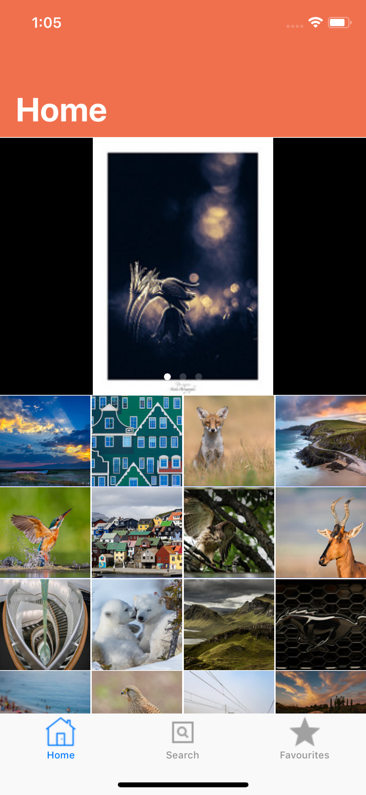
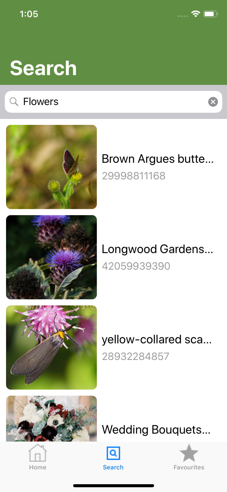
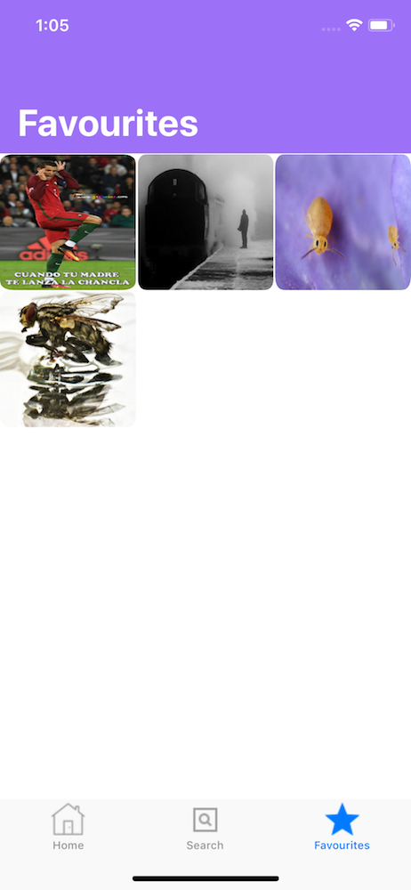

# Image-Zen

A Basic Flickr client which uses REST format to access the Flickr API endpoints. 
The App has 3 sections :  Interesting Photos, Search and Favourites.

The Application heavliy uses the UICollectionView, UICollectionViewFlowLayout and Custom UICollectionViewCell for layouts.

It's an universal app which supports all iPhone screen sizes including the iPhone X.

## APP Sections

### Interesting Photos

Random interesting photos from the Flickr API, which are updated almost daily.
Can save any of the above image to the device.

  

### Search

Search for any image that may be available in the Flickr database and save it on your device.

  

### Favourites

Favourites section provides a grid view of all the saved images from the Interesting or Search section.

  

## Cocoa Pods
The App has 2 CocoaPods for Network Communication and Image Caching.

#### Alamofire
This Pod provides a nice wrapper around the URL Session class to make request to the Flickr API endpoints.

#### Alamofire Image
For image caching the App uses the Alamofire Image Pod, which caches images upto 120 MB, once the limit is reached the
auto purging mechanism reduces the cache size upto 60MB.
Once the images are downloaded from the Flickr's servers they are added to the cache and if the App tries to fetch the same image
again instead of fetching it over the network the App load's the image from the cache.
