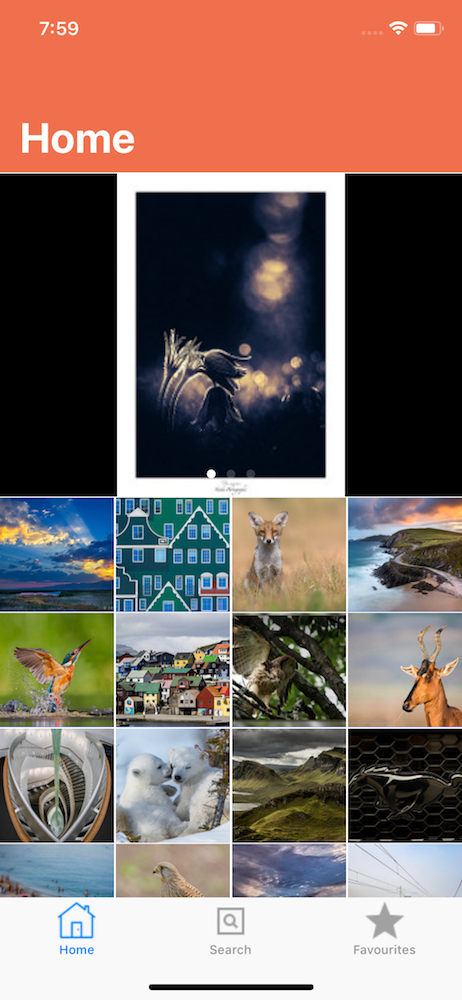

# Image-Zen

A Basic Flickr client which uses the RESTFUL endpoints of the Flickr API. 
The App has 3 Screens :  Interesting Photos, Search and Favourites.

## Interesting Photos

Here the some random interesting photos from the Flickr API are fetched.

  

## Search

You can search for any image that may be available in the Flickr datasource.

  

## Favourites

Favourites allows you to save any image from the Search or Interesting Photos section to be 
saved on your device.

  

